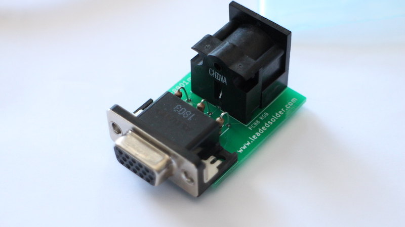
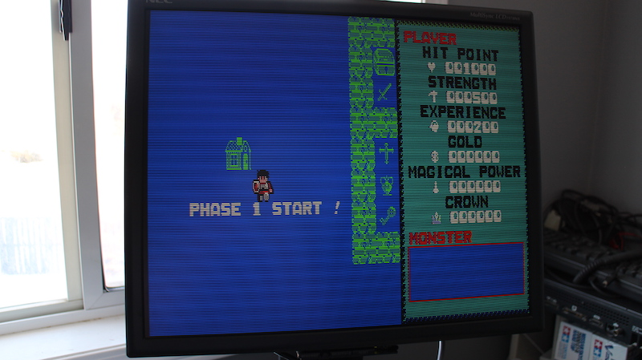

# PC-8801mkII VGA
This is a video adapter I built to go from my 1984 NEC PC-8801mkII's 3-bit digital RGB-out port to a VGA monitor. If you have an SR or newer, you can (and should) just use analogue RGB to VGA adapters instead.

# Bill of Materials
 * CUI SDS-80J 270-degree right-angle DIN female socket (CP-2380-ND)
 * TE AMP 1-1734530-1 VGA connector (A35116-ND)
 * 3x 150-ohm resistors
 * 270° male-male 8-pin DIN cable (see below)
 
# Confirmed Working On
 * NEC PC-8801mkII
 * Fujitsu FM-7
 * Fujitsu FM-New7
 
# In Testing
 * NEC PC-6001mkII

# Assembly directions
 1. Solder both connectors to the board. The top side is the one marked with the LeadedSolder URL and the board name.
 2. Solder three 150Ω resistors into the spots for them in the middle of the board (Red, Green, Blue). The footprint is slightly too small for normal resistors, so I had to stand the resistor straight up and bend the other lead over.
 3. Connect the computer to the female DIN with a DIN8 extension cable such as the Ancable male-male 270° DIN8 cable (for Peavey Sanpera guitar pedals)
 4. Connect a 15/24kHz-capable VGA monitor (I use an NEC MultiSync 1970NX) to the female VGA connector with a standard VGA monitor cable.

